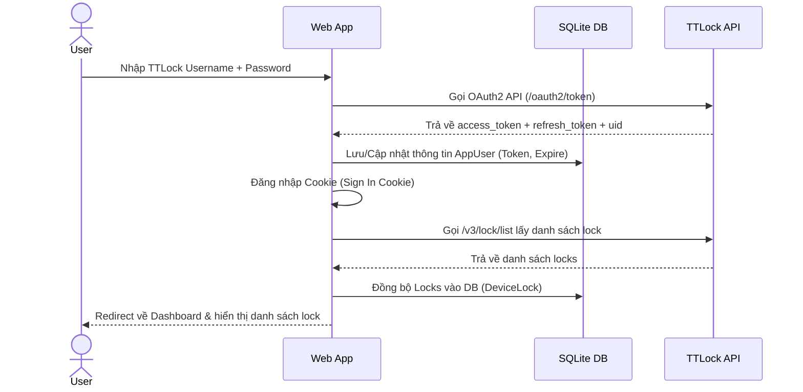

# Kế Hoạch: Đăng Nhập Bằng Tài Khoản TTLock & Tự Động Lấy Danh Sách Lock

Hệ thống hiện tại sử dụng tài khoản cấu hình cứng TTLock trong file cấu hình (`appsettings.json`) để thực hiện các thao tác quản lý khóa, và chưa có cơ chế đăng nhập của người dùng ứng dụng. Kế hoạch này nhằm thay thế hệ thống đăng nhập nội bộ bằng cách xác thực trực tiếp qua TTLock API (sử dụng tài khoản TTLock của chính user). Sau khi đăng nhập thành công, hệ thống sẽ tự động đồng bộ và hiển thị danh sách khóa từ tài khoản TTLock của họ mà không cần cấu hình thủ công.

## Luồng Hoạt Động Mới



## User Review Required

> [!IMPORTANT]
> **Bỏ hẳn cơ chế ASP.NET Identity**: Tài khoản TTLock sẽ đóng vai trò tài khoản đăng nhập chính của ứng dụng. Hệ thống sẽ không lưu mật khẩu của user, chỉ lưu trữ mã token truy cập (`access_token`, `refresh_token`) và thông tin liên kết.
>
> **Reset Database**: Do có sự thay đổi lớn về các bảng liên quan đến User và Locks, cơ sở dữ liệu SQLite cần được cập nhật cấu trúc mới. Dữ liệu cũ sẽ bị xóa hoặc cần migration.

## Open Questions

> [!IMPORTANT]
> **Câu hỏi 1**: Bạn có muốn một tài khoản TTLock có thể đăng nhập đồng thời trên nhiều phiên thiết bị/trình duyệt không?
> Nếu có, việc cập nhật `access_token` mới khi đăng nhập từ thiết bị B có thể làm hết hiệu lực session cũ ở thiết bị A nếu TTLock chỉ giữ một access_token hoạt động tại một thời điểm cho một cặp client_id/user. Hiện tại chúng tôi sẽ đề xuất lưu token trực tiếp vào bảng `AppUser` của từng người dùng.
>
> **Câu hỏi 2**: Về giao diện (UI) quản lý Locks, bạn có muốn hiển thị toàn bộ locks của tài khoản đó hay chỉ hiển thị các khóa được tick chọn để gán quản lý trong ứng dụng?
> *(Phương án đề xuất: Hiển thị danh sách lock từ DB đã đồng bộ và cho phép nhấn nút "Đồng bộ" để cập nhật danh sách mới nhất từ TTLock).*

## Proposed Changes

### Database & Models

---

#### [NEW] [AppUser.cs](file:///e:/Learning/TTLock/Models/AppUser.cs)
Bản ghi thông tin người dùng được liên kết trực tiếp với tài khoản TTLock.
```csharp
namespace TTLockManager.Models
{
    public class AppUser
    {
        public int Id { get; set; }
        public string TTLockUsername { get; set; } = string.Empty;
        public string DisplayName { get; set; } = string.Empty;
        public string AccessToken { get; set; } = string.Empty;
        public string RefreshToken { get; set; } = string.Empty;
        public DateTime TokenExpiresAt { get; set; }
        public DateTime LastLoginAt { get; set; }

        public ICollection<DeviceLock> DeviceLocks { get; set; } = new List<DeviceLock>();
    }
}
```

#### [NEW] [DeviceLock.cs](file:///e:/Learning/TTLock/Models/DeviceLock.cs)
Bảng quản lý các khóa thuộc sở hữu của người dùng được đồng bộ từ TTLock API.
```csharp
using System.ComponentModel.DataAnnotations;
using System.ComponentModel.DataAnnotations.Schema;

namespace TTLockManager.Models
{
    public class DeviceLock
    {
        public int Id { get; set; }
        
        public long LockId { get; set; } // ID khóa từ TTLock API
        
        [MaxLength(100)]
        public string LockName { get; set; } = string.Empty;
        
        [MaxLength(100)]
        public string LockAlias { get; set; } = string.Empty;
        
        [ForeignKey(nameof(AppUser))]
        public int AppUserId { get; set; }
        public AppUser AppUser { get; set; } = null!;
        
        public DateTime SyncedAt { get; set; } = DateTime.Now;
    }
}
```

#### [MODIFY] [AppDbContext.cs](file:///e:/Learning/TTLock/Data/AppDbContext.cs)
- Thêm DbSet cho `AppUser` và `DeviceLock`.
- Cấu hình index và mối quan hệ giữa các bảng trong `OnModelCreating`.

### Services

---

#### [MODIFY] [ITTLockApiClient.cs](file:///e:/Learning/TTLock/Services/ITTLockApiClient.cs)
Bổ sung các phương thức hỗ trợ xác thực bằng tài khoản của người dùng truyền vào (thay vì dùng token cấu hình cứng):
- `Task<TTLockTokenResponse> AuthenticateUserAsync(string username, string password);`
- `Task<TTLockTokenResponse> RefreshUserTokenAsync(string refreshToken);`
- `Task<TTLockRecordListResponse> GetLockRecordsWithTokenAsync(string accessToken, long lockId, long startDate, long endDate, int pageNo = 1, int pageSize = 100);`
- `Task<TTLockLockListResponse> GetLockListAsync(string accessToken, int pageNo = 1, int pageSize = 100);`
- Định nghĩa các DTO phản hồi mới tương ứng.

#### [MODIFY] [TTLockApiClient.cs](file:///e:/Learning/TTLock/Services/TTLockApiClient.cs)
Implement các phương thức API mới sử dụng token được truyền vào động.

#### [NEW] [UserSessionService.cs](file:///e:/Learning/TTLock/Services/UserSessionService.cs)
Hỗ trợ quản lý session, lấy thông tin User hiện tại từ Claims/Context, và tự động kiểm tra/refresh token trước khi thực hiện các yêu cầu API.

### Web Authentication & Pages

---

#### [MODIFY] [Program.cs](file:///e:/Learning/TTLock/Program.cs)
- Thêm Cookie Authentication.
- Đăng ký `UserSessionService` (Scoped).
- Đăng ký `IHttpContextAccessor` để hỗ trợ truy cập HttpContext trong các service.

#### [NEW] [Login.cshtml](file:///e:/Learning/TTLock/Pages/Account/Login.cshtml)
#### [NEW] [Login.cshtml.cs](file:///e:/Learning/TTLock/Pages/Account/Login.cshtml.cs)
Trang đăng nhập: Người dùng nhập Username/Password TTLock -> Gọi `AuthenticateUserAsync` -> Nếu thành công: Lưu/Cập nhật `AppUser` trong DB -> Thiết lập Authentication Cookie.

#### [NEW] [Logout.cshtml](file:///e:/Learning/TTLock/Pages/Account/Logout.cshtml)
#### [NEW] [Logout.cshtml.cs](file:///e:/Learning/TTLock/Pages/Account/Logout.cshtml.cs)
Trang đăng xuất: Xóa session cookie và chuyển hướng về trang đăng nhập.

#### [NEW] [Index.cshtml](file:///e:/Learning/TTLock/Pages/Locks/Index.cshtml)
#### [NEW] [Index.cshtml.cs](file:///e:/Learning/TTLock/Pages/Locks/Index.cshtml.cs)
Trang quản lý danh sách Lock:
- Hiển thị danh sách Lock đã đồng bộ trong DB của User hiện tại.
- Thêm nút "Đồng bộ từ TTLock" -> Gọi API lấy toàn bộ Lock -> Cập nhật/Thêm mới vào DB `DeviceLock`.

### Background Job

---

#### [MODIFY] [UsageTrackingBackgroundService.cs](file:///e:/Learning/TTLock/Services/UsageTrackingBackgroundService.cs)
- Cập nhật luồng chạy định kỳ: Thay vì lấy thông tin config cứng, duyệt qua tất cả `AppUser` trong DB.
- Với mỗi user: Kiểm tra và tự động refresh token nếu cần.
- Lấy danh sách `DeviceLock` của user đó và tiến hành poll records sử dụng token tương ứng.

## Verification Plan

### Automated Tests
*(Không áp dụng do ứng dụng không có sẵn khung test tự động).*

### Manual Verification
1. Xóa file database cũ `ttlock_manager.db` để hệ thống tự tạo lại cấu trúc mới khi khởi động.
2. Chạy ứng dụng, truy cập trang chủ -> Tự động chuyển hướng đến `/Account/Login`.
3. Đăng nhập bằng tài khoản TTLock thật.
4. Kiểm tra trong DB xem thông tin `AppUser` (Username, Access Token, Refresh Token) đã được tạo chính xác chưa.
5. Truy cập `/Locks` và nhấn **"Đồng bộ từ TTLock"**, xác nhận danh sách các ổ khóa được tải về và lưu vào bảng `DeviceLocks`.
6. Kiểm tra log của `UsageTrackingBackgroundService` xem quá trình poll records bằng token của user đã chạy thành công.
